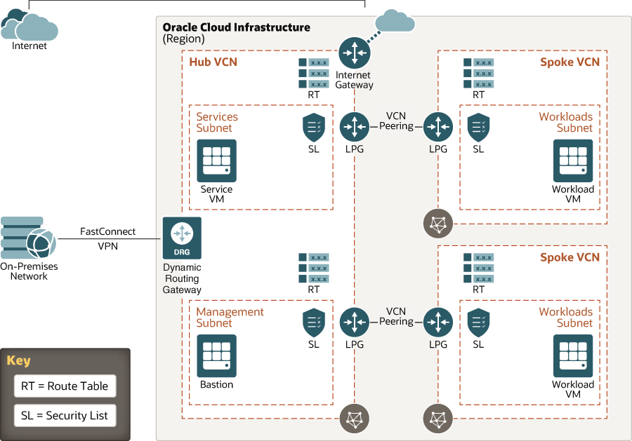

# oci-arch-hub-spoke

The hub-spoke topology (often called star topology) has a central component (the hub) that's connected to multiple networks around it, like a wheel. Implementing this topology in the traditional data center can be costly. But in the cloud, there’s no extra cost.

Use virtual cloud networks (VCNs) and the related components to build creative and powerful networking solutions in the cloud. The following are common use cases for the hub-spoke architecture:

- Segregation of environments for different workloads (development and production), different customers (of an ISV, for example), and so on

- Segregation to meet compliance requirements (for example, PCI and HIPAA)

- Shared services (log server, domain, file sharing) that are part of the IT infrastructure

## Terraform Provider for Oracle Cloud Infrastructure
The OCI Terraform Provider is now available for automatic download through the Terraform Provider Registry. 
For more information on how to get started view the [documentation](https://www.terraform.io/docs/providers/oci/index.html) 
and [setup guide](https://www.terraform.io/docs/providers/oci/guides/version-3-upgrade.html).

* [Documentation](https://www.terraform.io/docs/providers/oci/index.html)
* [OCI forums](https://cloudcustomerconnect.oracle.com/resources/9c8fa8f96f/summary)
* [Github issues](https://github.com/terraform-providers/terraform-provider-oci/issues)
* [Troubleshooting](https://www.terraform.io/docs/providers/oci/guides/guides/troubleshooting.html)

## Clone the Module
Now, you'll want a local copy of this repo. You can make that with the commands:

    git clone https://github.com/oracle-quickstart/oci-arch-hub-spoke.git
    cd oci-arch-hub-spoke
    ls

## Prerequisites
First off, you'll need to do some pre-deploy setup.  That's all detailed [here](https://github.com/cloud-partners/oci-prerequisites).

Secondly, create a `terraform.tfvars` file and populate with the following information:

```
# Authentication
tenancy_ocid         = "<tenancy_ocid>"
user_ocid            = "<user_ocid>"
fingerprint          = "<finger_print>"
private_key_path     = "<pem_private_key_path>"

# SSH Keys
ssh_public_key  = "<public_ssh_key_path>"

# Region
region = "<oci_region>"

# Compartment
compartment_ocid = "<compartment_ocid>"

````

Deploy:

    terraform init
    terraform plan
    terraform apply

## Destroy the Deployment
When you no longer need the deployment, you can run this command to destroy it:

    terraform destroy

## Hub spoke Architecture




## Reference Archirecture

- [Set up a hub-and-spoke network topology](https://docs.oracle.com/en/solutions/hub-spoke-network/index.html)
